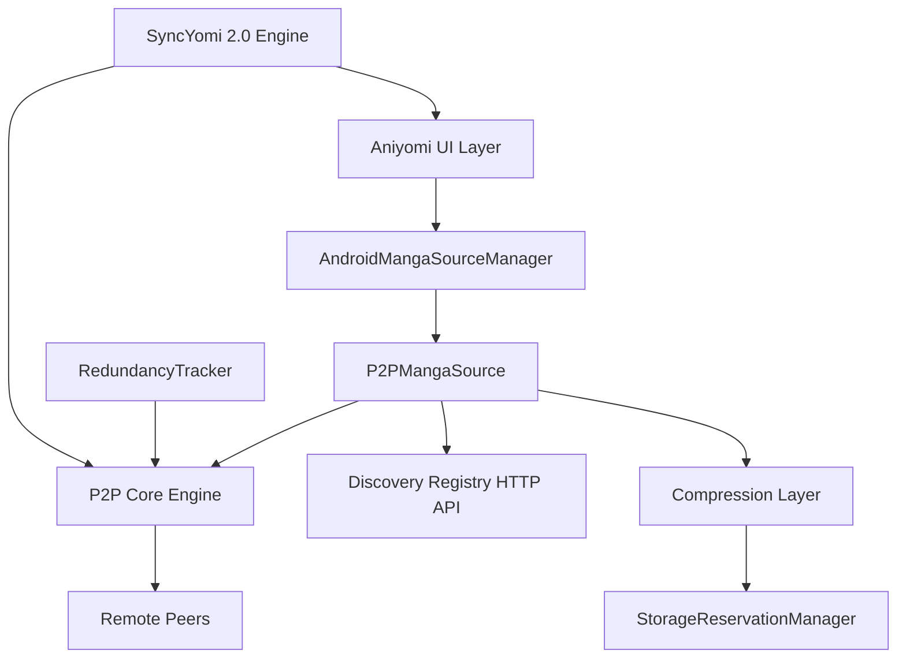
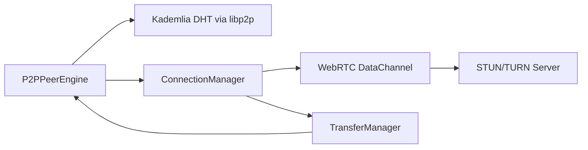
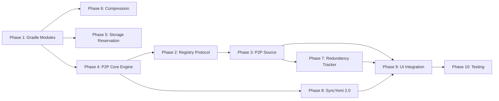

# Aniyomi P2P Fork — Full Architecture Plan

## Overview

This document describes the complete architecture for a stable fork of `aniyomiorg/aniyomi` that adds:

1. **P2P Source** — a built-in native source that behaves like a standard extension but fetches content from peers
2. **Storage Reservation Manager** — user-controlled capacity reservation with OS-level space locking
3. **Smart Compression Layer** — WebP images + Zstd/LZ4 metadata compression
4. **Redundancy Tracker** — per-device `manifest.json` with global re-seed scheduling
5. **SyncYomi 2.0** — Host/Client key-based sync over NAT using STUN/TURN/DHT

---

## Repository & Module Structure

```
aniyomi-p2p/
├── app/                          (existing, modified)
├── core/
│   ├── archive/                  (existing)
│   └── common/                   (existing, extended)
├── core-metadata/                (existing)
├── data/                         (existing, extended)
├── domain/                       (existing, extended)
├── source-api/                   (existing)
├── source-local/                 (existing)
│
│   ── NEW MODULES ──
├── p2p-core/                     NEW: P2P engine, DHT, WebRTC, peer management
├── p2p-source/                   NEW: P2PMangaSource + P2PAnimeSource implementations
├── storage-reservation/          NEW: StorageReservationManager + sparse file logic
├── compression/                  NEW: WebP encoder/decoder + Zstd/LZ4 wrappers
├── redundancy-tracker/           NEW: manifest.json tracker + re-seed scheduler
└── sync-yomi/                    NEW: SyncYomi 2.0 Host/Client engine
```

### `settings.gradle.kts` additions
```kotlin
include(":p2p-core")
include(":p2p-source")
include(":storage-reservation")
include(":compression")
include(":redundancy-tracker")
include(":sync-yomi")
```

---

## System Architecture Diagram



---

## Phase 1: Project Setup & New Gradle Modules

### New module: `p2p-core/build.gradle.kts`
```kotlin
plugins { id("mihon.library") }
dependencies {
    implementation(projects.core.common)
    implementation(libs.kotlinx.coroutines.android)
    implementation(libs.ktor.client.okhttp)          // HTTP for registry
    implementation(libs.libp2p.jvm)                  // io.libp2p:libp2p-core (JVM/Android)
    implementation(libs.webrtc.android)              // org.webrtc:google-webrtc
    implementation(libs.kotlinx.serialization.json)
}
```

### New module: `compression/build.gradle.kts`
```kotlin
plugins { id("mihon.library") }
dependencies {
    implementation(libs.zstd.jni)                    // com.github.luben:zstd-jni
    // LZ4 via lz4-java: net.jpountz.lz4:lz4
    implementation(libs.lz4.java)
    // WebP via Android's built-in BitmapFactory + WebP encoder (API 30+)
    // Fallback: com.github.zjupure:webpdecoder for older APIs
    implementation(libs.webp.decoder)
}
```

### New module: `storage-reservation/build.gradle.kts`
```kotlin
plugins { id("mihon.library") }
dependencies {
    implementation(projects.core.common)
    implementation(projects.domain)
    implementation(libs.kotlinx.coroutines.android)
}
```

### New module: `redundancy-tracker/build.gradle.kts`
```kotlin
plugins { id("mihon.library") }
dependencies {
    implementation(projects.core.common)
    implementation(projects.p2pCore)
    implementation(libs.kotlinx.serialization.json)
    implementation(libs.androidx.work.runtime.ktx)
}
```

### New module: `sync-yomi/build.gradle.kts`
```kotlin
plugins { id("mihon.library") }
dependencies {
    implementation(projects.p2pCore)
    implementation(projects.domain)
    implementation(libs.libp2p.jvm)
    implementation(libs.webrtc.android)
    implementation(libs.kotlinx.serialization.protobuf)
}
```

### Version catalog additions (`gradle/libs.versions.toml`)
```toml
[versions]
libp2p = "0.13.0"
webrtc = "1.0.32006"
zstd-jni = "1.5.5-11"
lz4-java = "1.8.0"
webp-decoder = "2.0.4.1"
ktor = "2.3.7"

[libraries]
libp2p-core = { module = "io.libp2p:libp2p-core", version.ref = "libp2p" }
webrtc-android = { module = "io.github.webrtc-sdk:android", version.ref = "webrtc" }
zstd-jni = { module = "com.github.luben:zstd-jni", version.ref = "zstd-jni" }
lz4-java = { module = "org.lz4:lz4-java", version.ref = "lz4-java" }
webp-decoder = { module = "com.github.zjupure:webpdecoder", version.ref = "webp-decoder" }
ktor-client-okhttp = { module = "io.ktor:ktor-client-okhttp", version.ref = "ktor" }
```

---

## Phase 2: P2P Source — Discovery Registry Protocol

### Registry Server Contract (REST + WebSocket)

The discovery registry is a lightweight server (can be self-hosted). The app communicates with it via HTTPS.

#### Endpoints

| Method | Path | Description |
|--------|------|-------------|
| GET | `/v1/manga` | Search/list manga in the P2P network |
| GET | `/v1/manga/{id}` | Get manga details |
| GET | `/v1/manga/{id}/chapters` | Get chapter list |
| POST | `/v1/announce` | Peer announces what content it seeds |
| GET | `/v1/peers/{contentHash}` | Get list of peers seeding a specific chapter |
| GET | `/v1/health` | Health check |

#### Announce Payload
```json
{
  "peerId": "QmXxx...",
  "multiaddrs": ["/ip4/1.2.3.4/tcp/4001", "/dns4/peer.example.com/tcp/4001"],
  "seeding": [
    { "mangaId": "abc123", "chapterId": "ch001", "contentHash": "sha256:..." }
  ],
  "timestamp": 1700000000
}
```

#### Data Models (`p2p-source/src/main/kotlin/p2p/source/model/`)
```kotlin
data class P2PMangaDto(
    val id: String,
    val title: String,
    val coverUrl: String,
    val author: String?,
    val description: String?,
    val genres: List<String>,
    val status: Int,
    val lang: String,
)

data class P2PChapterDto(
    val id: String,
    val mangaId: String,
    val name: String,
    val number: Float,
    val uploadDate: Long,
    val contentHash: String,   // SHA-256 of the chapter archive
    val pageCount: Int,
)

data class P2PPeerInfo(
    val peerId: String,
    val multiaddrs: List<String>,
    val latencyMs: Int?,
)
```

---

## Phase 3: P2P Source — Android Source Implementation

### `P2PMangaSource` class

**Location:** `p2p-source/src/main/kotlin/p2p/source/manga/P2PMangaSource.kt`

```kotlin
class P2PMangaSource(
    private val registryClient: P2PRegistryClient,
    private val peerEngine: P2PPeerEngine,
    private val compressionLayer: CompressionLayer,
) : CatalogueSource, UnmeteredSource {

    override val id: Long = P2P_MANGA_SOURCE_ID   // fixed constant
    override val name: String = "P2P Network"
    override val lang: String = "all"
    override val supportsLatest: Boolean = true

    override suspend fun getPopularManga(page: Int): MangasPage { ... }
    override suspend fun getSearchManga(page: Int, query: String, filters: FilterList): MangasPage { ... }
    override suspend fun getMangaDetails(manga: SManga): SManga { ... }
    override suspend fun getChapterList(manga: SManga): List<SChapter> { ... }

    // Key method: fetches pages from peers, not from HTTP server
    override suspend fun getPageList(chapter: SChapter): List<Page> {
        val chapterHash = chapter.url  // url field stores contentHash
        val peers = registryClient.getPeers(chapterHash)
        val bestPeer = peerEngine.selectBestPeer(peers)
        return peerEngine.fetchChapterPages(bestPeer, chapterHash)
    }
}
```

**Registration in `AndroidMangaSourceManager`:**
```kotlin
// In the mutableMap initialization block, alongside LocalMangaSource:
P2P_MANGA_SOURCE_ID to P2PMangaSource(Injekt.get(), Injekt.get(), Injekt.get())
```

### `P2PAnimeSource` — mirrors the above for anime content.

### Source ID Constants
```kotlin
// p2p-source/src/main/kotlin/p2p/source/P2PSourceConstants.kt
const val P2P_MANGA_SOURCE_ID = 0x5032504D616E6761L  // "P2PManga" as Long
const val P2P_ANIME_SOURCE_ID = 0x503250416E696D65L  // "P2PAnime" as Long
```

---

## Phase 4: P2P Core Engine

### Architecture



### `P2PPeerEngine` interface
```kotlin
interface P2PPeerEngine {
    suspend fun start()
    suspend fun stop()
    suspend fun selectBestPeer(peers: List<P2PPeerInfo>): P2PPeerInfo
    suspend fun fetchChapterPages(peer: P2PPeerInfo, contentHash: String): List<Page>
    suspend fun seedChapter(contentHash: String, data: ByteArray)
    fun getLocalPeerId(): String
    fun getLocalMultiaddrs(): List<String>
}
```

### `LibP2PPeerEngine` implementation
- Uses `io.libp2p:libp2p-core` for DHT peer discovery
- Falls back to WebRTC DataChannel for NAT traversal
- STUN servers: `stun:stun.l.google.com:19302`, `stun:stun1.l.google.com:19302`
- TURN server: configurable in settings (user-provided or community server)
- Protocol ID: `/aniyomi-p2p/1.0.0`

### Connection flow
```
1. App starts → P2PPeerEngine.start()
2. Engine connects to DHT bootstrap nodes
3. Engine announces local peer ID + multiaddrs to registry
4. On content request:
   a. Query registry for peers seeding contentHash
   b. Try direct TCP/QUIC connection first
   c. If NAT blocked → initiate WebRTC offer/answer via registry signaling
   d. Transfer chapter archive over data channel
5. Decompress + cache locally
```

### Transfer Protocol (binary framing)
```
[4 bytes: magic "P2PM"]
[4 bytes: version = 1]
[32 bytes: SHA-256 content hash]
[4 bytes: total chunks]
[4 bytes: chunk index]
[4 bytes: chunk size]
[N bytes: chunk data (Zstd compressed)]
```

---

## Phase 5: Storage Reservation Manager

### Design Goals
- User picks a "Reserved Capacity" (e.g., 5 GB) in Settings
- App creates a **sparse file** (`p2p_reserved.bin`) in the P2P downloads directory
- The sparse file reports its nominal size to the OS, preventing other apps from filling that space
- Actual P2P data is stored in a real subdirectory; the sparse file is a placeholder
- UI shows: `Allocated: 5.0 GB | Used by P2P: 1.2 GB | Free in reservation: 3.8 GB`

### `StorageReservationManager`
**Location:** `storage-reservation/src/main/kotlin/p2p/storage/StorageReservationManager.kt`

```kotlin
class StorageReservationManager(
    private val context: Context,
    private val storageManager: StorageManager,
    private val prefs: StorageReservationPreferences,
) {
    // Creates/resizes the sparse reservation file
    suspend fun setReservedCapacity(bytes: Long)

    // Returns current allocation state
    fun getReservationState(): ReservationState

    // Called before writing P2P data; checks if space is available within reservation
    suspend fun canAllocate(bytes: Long): Boolean

    // Releases reservation (deletes sparse file)
    suspend fun releaseReservation()
}

data class ReservationState(
    val reservedBytes: Long,
    val usedByP2PBytes: Long,
    val freeInReservationBytes: Long,
    val totalDeviceFreeBytes: Long,
)
```

### Sparse File Creation (Android)
```kotlin
// Uses RandomAccessFile + FileChannel to create a sparse file
private fun createSparseFile(path: File, sizeBytes: Long) {
    RandomAccessFile(path, "rw").use { raf ->
        raf.setLength(sizeBytes)  // Creates sparse file on Linux/ext4/f2fs
        // On Android, this is a true sparse file — no actual disk blocks allocated
        // until data is written
    }
}
```

### `StorageReservationPreferences`
```kotlin
class StorageReservationPreferences(private val preferenceStore: PreferenceStore) {
    fun reservedCapacityBytes() = preferenceStore.getLong("p2p_reserved_bytes", 0L)
    fun reservationEnabled() = preferenceStore.getBoolean("p2p_reservation_enabled", false)
}
```

---

## Phase 6: Smart Compression Layer

### Image Compression: WebP

**Location:** `compression/src/main/kotlin/p2p/compression/ImageCompressor.kt`

```kotlin
interface ImageCompressor {
    // Compress to WebP Lossy (quality 85 default) — visually identical
    suspend fun compressToWebPLossy(input: InputStream, quality: Int = 85): ByteArray

    // Compress to WebP Lossless — bit-perfect
    suspend fun compressToWebPLossless(input: InputStream): ByteArray

    // Decode WebP back to Bitmap
    suspend fun decodeWebP(input: ByteArray): Bitmap
}
```

**Implementation notes:**
- Android API 30+: use `Bitmap.compress(Bitmap.CompressFormat.WEBP_LOSSY, quality, out)`
- Android API < 30: use `com.github.zjupure:webpdecoder` library
- Lossless: `Bitmap.CompressFormat.WEBP_LOSSLESS` (API 30+) or libwebp via NDK

### Metadata Compression: Zstd

**Location:** `compression/src/main/kotlin/p2p/compression/MetadataCompressor.kt`

```kotlin
interface MetadataCompressor {
    fun compress(data: ByteArray): ByteArray    // Zstd compress
    fun decompress(data: ByteArray): ByteArray  // Zstd decompress
    fun compressLZ4(data: ByteArray): ByteArray // LZ4 for speed-critical paths
    fun decompressLZ4(data: ByteArray): ByteArray
}
```

**Strategy:**
- `manifest.json` → Zstd (best ratio, ~3:1 on JSON)
- Chapter transfer chunks → Zstd level 3 (balanced speed/ratio)
- Real-time streaming metadata → LZ4 (fastest, ~2:1)

### Compression Pipeline
```
Source Image (JPEG/PNG)
    ↓ ImageCompressor.compressToWebPLossy(quality=85)
WebP Blob (~40-60% smaller than JPEG)
    ↓ stored in P2P cache directory
    ↓ served to reader via ContentProvider URI
```

---

## Phase 7: Redundancy Tracker

### `manifest.json` Schema
**Location:** `{p2p_downloads}/manifest.json`

```json
{
  "deviceId": "uuid-v4",
  "schemaVersion": 1,
  "lastUpdated": 1700000000,
  "seeding": [
    {
      "mangaId": "abc123",
      "chapterId": "ch001",
      "contentHash": "sha256:...",
      "storedAt": 1700000000,
      "sizeBytes": 5242880,
      "isTemporary": false,
      "globalRedundancy": 3
    }
  ]
}
```

### `RedundancyTracker` interface
```kotlin
interface RedundancyTracker {
    suspend fun recordChapterStored(entry: ManifestEntry)
    suspend fun removeChapterEntry(contentHash: String)
    suspend fun getManifest(): P2PManifest
    suspend fun updateGlobalRedundancy(contentHash: String, count: Int)
    suspend fun getChaptersNeedingReseeding(threshold: Int = 20): List<ManifestEntry>
}
```

### Re-seed Scheduler (WorkManager)
**Location:** `redundancy-tracker/src/main/kotlin/p2p/redundancy/ReseedWorker.kt`

```kotlin
class ReseedWorker(context: Context, params: WorkerParameters) : CoroutineWorker(context, params) {
    override suspend fun doWork(): Result {
        val lowRedundancyChapters = tracker.getChaptersNeedingReseeding(threshold = 20)
        lowRedundancyChapters.forEach { entry ->
            // Push chapter data to available peers
            peerEngine.seedChapter(entry.contentHash, loadChapterData(entry))
            // Update registry with new redundancy count
            registryClient.announceSeeding(entry.contentHash)
        }
        return Result.success()
    }
}
```

**Scheduling:** Periodic work every 6 hours, requires network + not low battery.

### Redundancy Flow
```
1. Registry tracks global seeder count per contentHash
2. Every 6h, ReseedWorker queries registry for low-redundancy chapters
3. If globalRedundancy < 20% of target (configurable, default 5 seeders):
   a. Worker fetches chapter from a peer (if not locally stored)
   b. Stores locally as temporary seed
   c. Announces to registry
4. Temporary seeds are evicted when storage reservation is full (LRU)
```

---

## Phase 8: SyncYomi 2.0

### Design Goals
- Replace SyncYomi 1.x (server-dependent HTTP sync) with P2P-native sync
- Works over NAT/different networks using the same P2P core engine
- Host/Client model: one device is "Host" (source of truth), others are "Clients"
- Sync payload: library state, read progress, categories, tracking data

### Key Exchange
```
Host generates: Ed25519 keypair
Host displays: QR code containing { hostPeerId, publicKey, syncCode }
Client scans QR → stores hostPeerId + publicKey
Client sends: { clientPeerId, clientPublicKey } encrypted with host's public key
Host approves client → stores clientPeerId
```

### `SyncYomiEngine` interface
```kotlin
interface SyncYomiEngine {
    // Host operations
    suspend fun startHosting(): SyncHostSession
    suspend fun approveClient(clientPeerId: String)
    suspend fun revokeClient(clientPeerId: String)
    suspend fun pushSyncToClients(payload: SyncPayload)

    // Client operations
    suspend fun connectToHost(hostPeerId: String, syncCode: String): SyncClientSession
    suspend fun pullSyncFromHost(): SyncPayload
    suspend fun pushProgressToHost(progress: ReadProgressUpdate)

    // Bidirectional
    suspend fun performFullSync(): SyncResult
}
```

### `SyncPayload` (Protobuf serialized)
```kotlin
@Serializable
data class SyncPayload(
    val version: Int,
    val timestamp: Long,
    val deviceId: String,
    val libraryManga: List<SyncMangaEntry>,
    val libraryAnime: List<SyncAnimeEntry>,
    val readProgress: List<ReadProgressEntry>,
    val categories: List<CategoryEntry>,
    val trackingData: List<TrackingEntry>,
)
```

### NAT Traversal Strategy
```
1. Try direct connection via stored multiaddrs
2. If blocked: use DHT to find current multiaddrs
3. If still blocked: WebRTC offer/answer via registry signaling relay
4. STUN: stun.l.google.com:19302 (default)
5. TURN: user-configurable (coturn self-hosted recommended)
```

### Conflict Resolution
- **Last-Write-Wins** with vector clocks per entry
- Read progress: always take the furthest-read position
- Library additions: union merge (never delete on sync)
- Library deletions: require explicit confirmation on both devices

---

## Phase 9: UI Integration

### New Settings Screens

#### P2P Settings Screen
**Location:** `app/src/main/java/eu/kanade/tachiyomi/ui/setting/P2PSettingsScreen.kt`

Sections:
- **P2P Network**: Enable/disable, peer ID display, connected peers count
- **Discovery Registry**: Registry URL (default + custom), announce interval
- **TURN Server**: URL, username, password (optional)

#### Storage Reservation Screen
**Location:** `app/src/main/java/eu/kanade/tachiyomi/ui/setting/StorageReservationScreen.kt`

Components:
- Slider: Reserved Capacity (0 GB – 50 GB)
- Progress bar: `Allocated [████░░░░] 1.2 GB / 5.0 GB`
- Text: `Device free space: 12.4 GB`
- Button: Release Reservation

#### SyncYomi 2.0 Screen
**Location:** `app/src/main/java/eu/kanade/tachiyomi/ui/setting/SyncYomiScreen.kt`

Components:
- Mode selector: Host / Client / Disabled
- Host mode: QR code display, connected clients list, revoke buttons
- Client mode: QR scanner, host connection status, last sync time
- Sync now button

### P2P Source Card in Browse
The P2P source appears in the Browse → Sources list as a pinned source with a special "P2P" badge. No installation required — it's always present.

### Compression Settings
- Image quality slider (WebP lossy quality: 60–100, default 85)
- Lossless toggle (for archival mode)
- Metadata compression selector (Zstd / LZ4 / None)

---

## Phase 10: Testing Strategy

### Unit Tests
- `P2PRegistryClient`: mock HTTP responses, test pagination/search
- `StorageReservationManager`: test sparse file creation, capacity math
- `MetadataCompressor`: round-trip compress/decompress correctness
- `ImageCompressor`: WebP encode/decode, SSIM quality check
- `RedundancyTracker`: manifest read/write, threshold detection
- `SyncYomiEngine`: conflict resolution logic, payload serialization

### Integration Tests
- P2P source appears in `AndroidMangaSourceManager.getCatalogueSources()`
- End-to-end: announce → discover → fetch chapter pages from mock peer
- Storage reservation: sparse file size reported correctly by `StatFs`

### Instrumented Tests (Android)
- WebP compression on real device (API 28, 30, 33)
- WorkManager ReseedWorker execution
- SyncYomi QR code generation + scanning

---

## Implementation Order (Recommended)



---

## Key Dependencies Summary

| Library | Purpose | Module |
|---------|---------|--------|
| `io.libp2p:libp2p-core` | DHT peer discovery, protocol multiplexing | `p2p-core` |
| `io.github.webrtc-sdk:android` | WebRTC DataChannel for NAT traversal | `p2p-core`, `sync-yomi` |
| `com.github.luben:zstd-jni` | Zstd compression for metadata | `compression` |
| `org.lz4:lz4-java` | LZ4 fast compression for streaming | `compression` |
| `com.github.zjupure:webpdecoder` | WebP decode on API < 30 | `compression` |
| `io.ktor:ktor-client-okhttp` | Registry HTTP client | `p2p-core` |
| `androidx.work:work-runtime-ktx` | ReseedWorker scheduling | `redundancy-tracker` |
| `kotlinx.serialization:protobuf` | Sync payload serialization | `sync-yomi` |

---

## Security Considerations

1. **Content integrity**: All chapter data verified against SHA-256 `contentHash` before caching
2. **Peer authentication**: Ed25519 signatures on all P2P protocol messages
3. **Sync encryption**: Sync payloads encrypted with recipient's public key (NaCl box)
4. **Registry trust**: Registry is discovery-only; it never serves content, only peer addresses
5. **No CSAM**: Content hash blacklist checked against known-bad hashes before seeding

---

## Backward Compatibility

- All existing sources, extensions, and downloads remain fully functional
- P2P source is opt-in (disabled by default)
- Storage reservation is opt-in (0 GB default)
- SyncYomi 2.0 is independent of SyncYomi 1.x; both can coexist during migration
- No changes to existing database schema; new tables added with migrations
